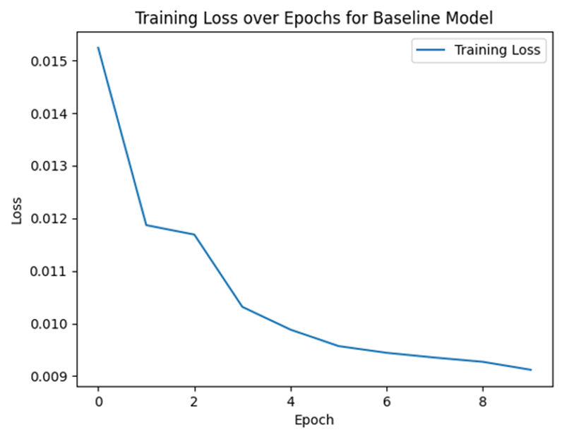

# 🚲 Predicting and Optimizing NYC Bike Demand using Deep Learning

This project uses deep learning to predict the demand for Lyft bike end stations in **Jersey City, NYC**, using historical ride data. It applies both **Simple Neural Networks** and **Gated Recurrent Units (GRU)** to forecast demand patterns and optimize bike distribution.

> 📁 Includes: Full modeling pipeline from data extraction to GRU-based prediction

---

## 🎯 Project Overview

- Predicts demand at bike **destination stations** based on time, location, and user features
- Supports **bike placement optimization** by forecasting high-demand stations
- Explores impact of temporal, spatial, and user-related variables
- Highlights post-COVID usage trends in public bike-sharing systems

---

## 🧱 Project Milestones

1. **Data Extraction & Cleaning**  
   - Merged 24 months of data from JC 2021 & 2022
   - Converted to CSV and Pickle format
   - Focused on post-COVID patterns

2. **Exploratory Data Analysis**  
   - Visualized trip durations, start/end time peaks, most used stations, and day-wise trends
   - Mapped demand hotspots across Jersey City

3. **Baseline Learning**  
   - Built a simple neural network using features like coordinates, ride type, trip duration, and time features
   - Achieved test **MSE of 0.0015**

4. **Deep Learning with GRU**  
   - Implemented GRU to model temporal dependencies in demand
   - Tuned hidden layers, optimizers (Adam vs AdamW), batch size, and epochs
   - Best GRU model reached test **MSE of 0.0090**

5. **Feature Importance Analysis**  
   - Used **Linear Regression** to approximate feature weights (due to GRU complexity)
   - Found `end_lng`, `start_lat`, and `member type` were most influential

---

## 🖼 Visual Results

### 📉 Baseline Model – Training Loss



### 📉 GRU Model – Training Loss Across Hyperparameters (learning Rate, Number of Epochs, Hidden Layer Size, Batch Size)

**Hyperparamter {0.001, 10, 32, 50} and AdamW optimizer:**


**Hyperparamter {0.1, 15, 64, 100} and AdamW optimizer :**


**Hyperparamter {0.001, 10, 128, 100} and Adam optimizer :**


### 📊 Feature Importance:


## 🔍 Key Insights

- **Weekdays > Weekends**: Significantly higher demand
- **Peak demand at 6–7 PM & 8 AM**: Aligns with commute patterns
- **"Grove St PATH"** is the most visited start & end station
- **Short trips (<10 mins)** dominate usage
- **Post-COVID** trends show demand rebounding & stabilizing

---

## 🛠 Technologies Used

- Python (Pandas, NumPy, Matplotlib, Seaborn)
- PyTorch (Neural Nets, GRUs)
- Scikit-learn (Preprocessing, Feature Importance)
- Pickle for data storage

---

## 📂 Key Files

| File | Description |
|------|-------------|
| `Data_extraction.ipynb` | Raw data loading and cleaning |
| `Data_exploration_2.ipynb` | Visualizations and EDA |
| `Baseline_Learning.ipynb` | Simple Neural Network model |
| `Deep_Learning_GRU.ipynb` | GRU model and optimizer tuning |
| `Hyperparameter tuning.ipynb` | Experiments with learning rate, hidden size, etc. |
| `Feature_Importance.ipynb` | Feature ranking using linear regression |

---

## ⚙️ How to Run

1. Install dependencies:
```bash
pip install torch pandas matplotlib scikit-learn
```

2. Launch Jupyter and run notebooks in sequence:
```bash
jupyter notebook Data_extraction.ipynb
```

---

## 📘 References

- NYC Citi Bike (Lyft) datasets – Jersey City
- Research on GRU/RNN architectures and demand prediction

